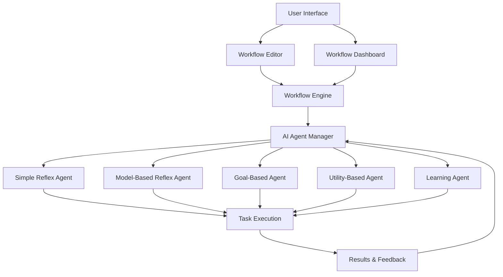

# AI Agent Workflow Creator Plan

## Supported AI Agent Types
1. Simple Reflex Agents
2. Model-Based Reflex Agents
3. Goal-Based Agents
4. Utility-Based Agents
5. Learning Agents

## Core Features
### Workflow Management
- Create, edit, and delete workflows
- Version control with history tracking
- Private workflows per user
- Workflow templates for common tasks

### AI Agent Capabilities
- Perception and environment interaction
- Decision-making and action execution
- Continuous learning and improvement
- Natural Language Processing (NLP)
- Complex reasoning and task breakdown
- Collaboration between multiple agents

## Architecture Overview

## Implementation Plan

### Phase 1: Core Infrastructure
1. Expand Redux state management for workflows
2. Create workflow editor component
3. Implement basic AI agent interfaces

### Phase 2: Workflow Execution
1. Develop workflow engine
2. Implement task execution pipeline
3. Add version control system

### Phase 3: Advanced Features
1. Add collaboration between agents
2. Implement learning capabilities
3. Add monitoring and optimization tools

### Phase 4: UI/UX Enhancements
1. Create intuitive workflow editor
2. Develop keyboard-driven navigation
3. Add visual feedback and status indicators

## Technology Stack
- React with TypeScript
- Redux Toolkit for state management
- Material UI for components
- Vite for build tooling
- Mermaid for diagram rendering