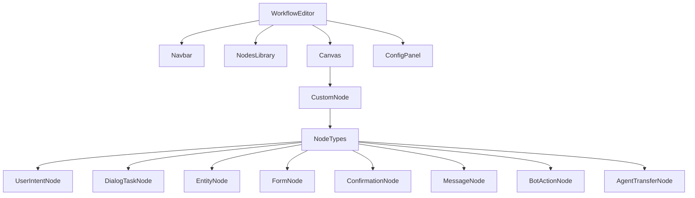

# Workflow Builder UI Implementation Plan

## Component Structure

## Implementation Details

1. **Component Structure**
   - Create separate components for Navbar, NodesLibrary, Canvas, and ConfigPanel
   - Update WorkflowEditor to compose these components

2. **Node Types**
   - Implement core node types:
     - User Intent Node
     - Dialog Task Node
     - Entity Node
     - Form Node
     - Confirmation Node
     - Message Node
     - Bot Action Node
     - Agent Transfer Node
   - Use @xyflow/react for the node-based canvas

3. **Styling**
   - Maintain existing MUI components
   - Implement Figma-inspired theme and color scheme
   - Use Tailwind CSS for custom styling

## Next Steps

1. Switch to Code mode to begin implementation
2. Create initial component files
3. Set up @xyflow/react canvas
4. Implement core node types
5. Add styling and theme configuration